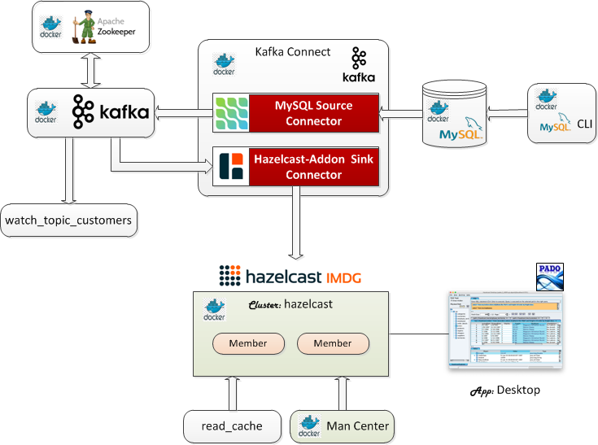
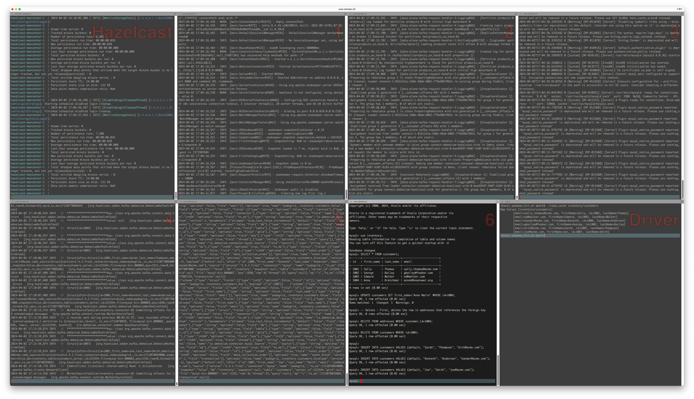

 [*PadoGrid*](https://github.com/padogrid) | [*Catalogs*](https://github.com/padogrid/catalog-bundles/blob/master/all-catalog.md) | [*Manual*](https://github.com/padogrid/padogrid/wiki) | [*FAQ*](https://github.com/padogrid/padogrid/wiki/faq) | [*Releases*](https://github.com/padogrid/padogrid/releases) | [*Templates*](https://github.com/padogrid/padogrid/wiki/Using-Bundle-Templates) | [*Pods*](https://github.com/padogrid/padogrid/wiki/Understanding-Padogrid-Pods) | [*Kubernetes*](https://github.com/padogrid/padogrid/wiki/Kubernetes) | [*Docker*](https://github.com/padogrid/padogrid/wiki/Docker) | [*Apps*](https://github.com/padogrid/padogrid/wiki/Apps) | [*Quick Start*](https://github.com/padogrid/padogrid/wiki/Quick-Start)

---

<!-- Platforms -->
[](https://github.com/padogrid/padogrid/wiki/Platform-PadoGrid-1.x) [](https://github.com/padogrid/padogrid/wiki/Platform-Host-OS) [](https://github.com/padogrid/padogrid/wiki/Platform-Docker) 

# Debezium-Kafka Hazelcast Connector

This bundle integrates Hazelcast with Debezium for ingesting initial data and CDC records from MySQL into a Hazelcast cluster via a Kafka sink connector included in the `padogrid` distribution. It supports inserts, updates and deletes.

## Installing Bundle

This bundle supports Hazelcast 3.12.x, 4.x, 5.x.

```console
install_bundle -download bundle-hazelcast-3n4n5-docker-debezium_kafka
```

❗️ If you are running this demo on WSL, make sure your workspace is on a shared folder. The Docker volume it creates will not be visible otherwise.

## Use Case

This use case ingests data changes made in the MySQL database into a Hazelcast cluster via Kafka connectors: the Debezium MySQL source connector and the `hazelcast-addon` Debezium sink connector.



## Required Software

- Docker
- Maven 3.x
- Hazelcast 3.12.x, 4.x, or 5.x

## Optional Software

- jq

## Debezium Tutorial

The demo follows the Debezium Tutorial steps shown in the link below.

https://debezium.io/documentation/reference/2.3/tutorial.html#registering-connector-monitor-inventory-database

All the commands provided in the tutorial are wrapped in the scripts found in the `bin_sh` directory. We'll use these scripts to simplify the demo.

## Building Demo

✏️  *This bundle builds the demo enviroment based on the Hazelcast and Management versions in your workspace. Make sure your workspace has been configured with the desired versions before building the demo environment.*

First, change your cluster context to a Hazelcast cluster. This is required in order to configure the Hazelcast Docker containers.

 Terminal Hazelcast

```bash
# Create a Hazelcast cluster if it does not already exist.
create_cluster -product hazelcast

# Switch context
switch_cluster myhz
```

Now, build the demo by running the `build_app` command as shown below. This command compiles and packages the `VersionedPortable` data (domain) classes found in the source directory `src`. It also copies the Hazelcast and `hazelcast-addon-core` jar files to the Docker container mounted volume in the `padogrid` directory so that the Hazelcast Debezium Kafka connector can include them in its class path.

 Terminal Hazelcast

```console
cd_docker debezium_kafka/bin_sh
./build_app
```

Upon successful build, the `padogrid` directory should have jar files similar to the following:

 Terminal Hazelcast

```console
cd_docker debezium_kafka
tree padogrid
```

```console
padogrid
├── etc
│   └── hazelcast-client.xml
├── lib
│   ├── hazelcast-addon-common-1.0.0.jar
│   ├── hazelcast-addon-core-5-1.0.0.jar
│   ├── hazelcast-enterprise-5.3.6.jar
│   └── padogrid-common-1.0.0.jar
├── log
└── plugins
    ├── hazelcast-addon-core-5-1.0.0-tests.jar
    └── hazelcast-addon-debezium_kafka-1.0.0.jar
```

## Creating `my_network`

Let's create the `my_network` network to which all containers will join.

 Terminal Hazelcast

```bash
docker network create my_network
```

## Creating Hazelcast Docker Containers

Let's create a Hazelcast cluster to run on Docker containers with the `my_network` network we created in the previous section.

 Terminal Hazelcast

```console
create_docker -product hazelcast -cluster hazelcast -network my_network
cd_docker hazelcast
```

### Configuring Hazelcast Cluster

If you will be querying Hazelcast, then you must register the `VersionedPortable` factory class we have built in the previous section. For example, you can use the `desktop` app to query and browse the data in the Hazelcast cluster. **You can skip this section if you won't be querying data.**

Edit `hazelcast.xml` and register the portable factory class as shown below.

 Terminal Hazelcast

```console
cd_docker hazelcast
vi padogrid/etc/hazelcast.xml
```

```xml
<hazelcast ...>
   ...
   <serialization>
      ...
      <portable-factory factory-id="20001">
      org.hazelcast.addon.demo.debezium.data.PortableFactoryImpl
      </portable-factory>
      ...
   </serialization>
   ...
</hazelcast>
```

Copy the demo data jar file into the `plugins` directory as follows.

 Terminal Hazelcast

```console
cd_docker hazelcast
cp $PADOGRID_WORKSPACE/docker/debezium_kafka/padogrid/plugins/hazelcast-addon-debezium_kafka-1.0.0.jar padogrid/plugins/
```

## Starting Docker Containers

There are numerous Docker containers to this demo. We'll first start the Hazelcast cluster containers and then proceed with the Debezium containers. By default, the scripts provided run the containers in the foreground so that you can view the log events. You will need to launch a total of eight (8) terminals. If you have a screen splitter such as Windows Terminal, it will make things easier.



You can also run some of the scripts in the background by including the `-d` option. These scripts are mentioned below.

### Start Hazelcast Containers

Start the `hazelcast` Hazelcast cluster containers.

 Terminal Hazelcast

```console
cd_docker hazelcast
docker compose up
```

### Start Debezium Containers

 Terminal 1-6

Launch six (6) terminals and run each script from their own terminal as shown below. Each script must be run from their own terminal as they will block and display log messages.

```console
cd_docker debezium_kafka/bin_sh

# 1. Start Zookeeper (include '-d' to run it in the background)
./start_zookeeper

# 2. Start Kafka (include '-d' to run it in the background)
./start_kafka

# 3. Start MySQL database (include '-d' to run it in the background)
./start_mysql

# 4. Start Kafka Connect (include '-d' to run it in the background)
./start_kafka_connect

# 5. Start topic watcher
./watch_topic_customers

# 6. Start MySQL CLI
./start_mysql_cli
```

### View Management Center

**URL:** http://localhost:8080/hazelcast-mancenter

If the managenment center prompts for adding a cluster config then make sure to enter the following.

```console
Cluster Name: dev
Cluster Config State: Enabled
Member Addresses: localhost (or your host os address)
```

### Register Kafka Connect via REST API

There are two (2) Kafka connectors that we must register. The MySQL connector is provided by Debezium and the Hazelcast connector is part of the PadoGrid distribution. 

 Terminal Driver

```console
cd_docker debezium_kafka/bin_sh
./register_mysql_connector
./register_debezium_hazelcast_connector
```

### Check Kafka Connect

 Terminal Driver

```console
# Check status
curl -Ss -H "Accept:application/json" localhost:8083/ | jq

# List registered connectors 
curl -Ss -H "Accept:application/json" localhost:8083/connectors/ | jq
```

The last command should display the inventory connector that we registered previously.

```console
[
  "debezium-hazelcast-sink",
  "inventory-connector"
]
```

### MySQL CLI

Using the MySQL CLI, you can change table contents. The changes you make will be captured in the form of change events by the Debezium source connector. The Hazelcast sink connector in turn receives the change events, transforms them into data objects and updates (or deletes) the assigned map, i.e., `inventory/customers`.

 Terminal 6

```console
use inventory;
SELECT * FROM customers;
UPDATE customers SET first_name='Anne Marie' WHERE id=1004;
-- Delete - First, delete the row in addresses that references the foreign key
DELETE FROM addresses WHERE customer_id=1004;
DELETE FROM customers WHERE id=1004;

INSERT INTO customers VALUES (default, "Sarah", "Thompson", "kitt@acme.com");
INSERT INTO customers VALUES (default, "Kenneth", "Anderson", "kander@acme.com");
```

### View Map Contents

To view the map contents, run the `read_cache` command as follows:

 Terminal Driver

```console
./read_cache inventory/customers
```

**Output:**

```console
Map Values [inventory/customers]:
        [email=gbailey@foobar.com, firstName=George, id=1002, lastName=Bailey]
        [email=sally.thomas@acme.com, firstName=Sally, id=1001, lastName=Thomas]
        [email=ed@walker.com, firstName=Edward, id=1003, lastName=Walker]
        [email=annek@noanswer.org, firstName=Anne Marie, id=1004, lastName=Kretchmar]
```

### Desktop

Optionally, you can also install the desktop app and query the map contents.

 Terminal Driver

```console
create_app -product hazelcast -app desktop
```

To use the destkop, we need to add the demo data jar file in its class path and set the `PortableFactory` class ID. By default, the workspace's `plugins` directory is in the desktop class path. Let's place the demo jar file there.

 Terminal Driver

```console
cp $PADOGRID_WORKSPACE/docker/debezium_kafka/padogrid/plugins/hazelcast-addon-debezium_kafka-1.0.0.jar $PADOGRID_WORKSPACE/plugins/
```

Edit the `pado.properties` file and enter the `PortableFactoryImpl` class as follows. The `PortableFactory` class ID is `20001.

 Terminal Driver

```console
cd_app desktop
vi etc/pado.properties
```

`etc/pado.properties` File:

```properties
hazelcast.client.config.serialization.portable.factories=1:org.hazelcast.demo.nw.data.PortableFactoryImpl,\
10000:org.hazelcast.addon.hql.impl.PortableFactoryImpl,\
20001:org.hazelcast.addon.demo.debezium.data.PortableFactoryImpl
```

Run the desktop.

 Terminal Driver

```console
cd_app desktop/bin_sh
./desktop
```


## Tearing Down

 Terminal Driver

```console
# Shutdown Debezium containers
cd_docker debezium_kafka/bin_sh
./cleanup

# Shutdown Hazelcast containers
cd_docker hazelcast
docker compose down

# Remove my_network
docker network rm my_network

# Prune all stopped containers 
docker container prune
```

---

 [*PadoGrid*](https://github.com/padogrid) | [*Catalogs*](https://github.com/padogrid/catalog-bundles/blob/master/all-catalog.md) | [*Manual*](https://github.com/padogrid/padogrid/wiki) | [*FAQ*](https://github.com/padogrid/padogrid/wiki/faq) | [*Releases*](https://github.com/padogrid/padogrid/releases) | [*Templates*](https://github.com/padogrid/padogrid/wiki/Using-Bundle-Templates) | [*Pods*](https://github.com/padogrid/padogrid/wiki/Understanding-Padogrid-Pods) | [*Kubernetes*](https://github.com/padogrid/padogrid/wiki/Kubernetes) | [*Docker*](https://github.com/padogrid/padogrid/wiki/Docker) | [*Apps*](https://github.com/padogrid/padogrid/wiki/Apps) | [*Quick Start*](https://github.com/padogrid/padogrid/wiki/Quick-Start)
